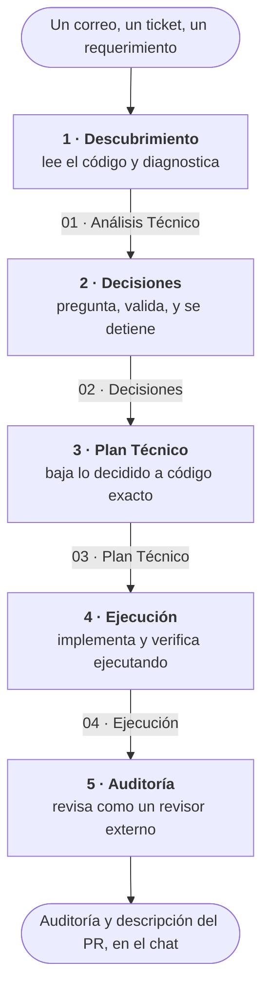

# 🧠 MCP Orquestador

*Léelo en [inglés](README.md) · Este es el README en español.*

Un servidor MCP (Model Context Protocol) que parte cada requerimiento en **cinco fases con compuerta** y obliga a que cada una deje su documento antes de pasar a la siguiente. En el panel de tu cliente se identifica como `mcp-phase-gate`.

## El problema

Le pides a un asistente de IA que implemente un requerimiento y hace lo que hacen todos: se lanza a escribir código. Rompe algo que no había leído. Toma en silencio decisiones que nunca te consultó. Y cuando cambias de chat, o te sientas en la otra computadora, el razonamiento entero se perdió — porque vivía en la conversación, y **la conversación no viaja**.

## Cómo lo resuelve

El asistente no llega a tocar código hasta la fase 4. Para entonces ya diagnosticó leyendo el repositorio, te preguntó lo que no podía decidir solo, y escribió un plan contrastado contra el código real. Cada fase deja un documento en una carpeta central, así que lo que se pensó sobrevive al chat y al dispositivo.



**La parada obligatoria está en la fase 2**: ahí se detiene y no avanza hasta que respondas. No es una sugerencia de que pregunte — es que la fase no cierra sin tus respuestas, y lo que decidas queda escrito con su fundamento.

Y entre una fase y otra hay una **compuerta**, que es lo que le da el nombre al servidor: si pides una fase saltándote la anterior, el servidor lo detecta y avisa ([ver abajo](#-la-compuerta-saltarse-una-fase-deja-de-ser-invisible)).

En la fase 5 la IA solo lee. **Los commits y el PR los haces tú**, siempre.

## Para quién es

Para quien trabaja sobre **código que ya existe y no se puede romper**, y necesita que quede constancia de por qué se hizo cada cosa. Encaja especialmente si trabajas desde más de un equipo, o si te toca justificar decisiones semanas después.

No es para prototipos desechables ni para arrancar un proyecto de cero: cinco fases para cambiar un color es una ceremonia absurda.

Habla MCP estándar, así que funciona en cualquier cliente compatible. Está **probado en Cursor, VS Code y Claude Code** — ver [Paso 4](#paso-4--registrar-el-mcp-en-tu-cliente).

---

## 📁 Cómo se organiza la Documentación

Cada tarea vive dentro de una carpeta con esta estructura fija:

```
DOCUMENTACIÓN/
├── PROYECTO-A/
│   └── Proyectos/
│       └── <nombre_de_la_tarea>/
│           ├── 00 - Contexto Inicial.md   ← lo escribe start_task
│           ├── 01 - Análisis Técnico.md   ← Fase 1
│           ├── 02 - Decisiones.md         ← Fase 2
│           ├── 03 - Plan Técnico.md       ← Fase 3
│           ├── 04 - Ejecución.md          ← Fase 4
│           └── 05 - Auditoría.md          ← Fase 5
├── PROYECTO-B/
│   └── Proyectos/
│       └── <nombre_de_la_tarea>/
└── PROYECTO-C/
    └── Proyectos/
        └── <nombre_de_la_tarea>/
```

`PROYECTO-A`, `PROYECTO-B` y `PROYECTO-C` son de ejemplo: tus proyectos son las carpetas que tú tengas ahí, con los nombres que tú les pongas. El nivel `Proyectos` es la subcarpeta de tareas, y su nombre también es configurable — ver `ORQUESTADOR_TASKS_SUBDIR` más abajo.

> El servidor arma esta ruta **automáticamente**. Tú (o el LLM) solo indican `project`, `task_name` y `file_name`; no hay que escribir la ruta completa a mano.

---

## 💻 Configuración paso a paso (en CUALQUIER dispositivo)

El código es idéntico en todos lados; lo único que cambia de un equipo a otro son **las rutas a tus carpetas**, porque el usuario del sistema y la ubicación de la documentación son distintos. Por eso se configuran por variable de entorno y no en el código.

### Requisitos previos
- **Node.js 22 o superior** instalado. Verifícalo con `node -v`. Es lo que declara el `package.json` y lo único que CI prueba (22 y 24); las versiones anteriores ya no tienen soporte.
- **Git** instalado.
- **Una carpeta para tu documentación**, disponible localmente. Si vive en una carpeta sincronizada (OneDrive, Google Drive, Dropbox, iCloud) viaja sola entre tus equipos, que es como se recomienda usarlo — pero no es obligatorio: al servidor solo le llega una ruta local y le da igual qué haya detrás.
- **Un cliente MCP**: Cursor, VS Code o Claude Code.

### Paso 1 — Clonar el repositorio
Elige una carpeta (recomendado mantener la misma estructura en ambos equipos, ej. `C:\proyectos\yo`):

```bash
git clone https://github.com/Montse2308/MCP_orquestador.git
cd MCP_orquestador
```

### Paso 2 — Instalar dependencias y compilar
La carpeta `build/` NO se sube al repo (está en `.gitignore`), así que hay que generarla en cada dispositivo:

```bash
npm install
npm run build
```

Esto crea `build/index.js`, que es lo que el cliente va a ejecutar.

### Paso 3 — Crear tu archivo `.env` con las rutas de ESTE equipo
La ruta de la Documentación cambia de un equipo a otro (el usuario del sistema, la letra de unidad, dónde la tengas), así que se configura por dispositivo en un archivo `.env` (que NO se sube al repo).

1. Copia la plantilla `.env.example` como `.env`:

```bash
copy .env.example .env
```

2. Averigua tu ruta real: abre el explorador de archivos, navega hasta tu carpeta de Documentación, haz clic en la barra de direcciones y copia la ruta completa.
3. Edita el `.env` y pon tus valores (aquí las barras invertidas van **simples**, sin comillas):

```ini
ORQUESTADOR_DOCS_PATH=C:\Users\TU_USUARIO\OneDrive - TU ORGANIZACIÓN\Documentos\DOCUMENTACIÓN
ORQUESTADOR_REPOS_PATH=C:\proyectos
```

> Ese `ORQUESTADOR_DOCS_PATH` es solo un **ejemplo** con una carpeta de OneDrive. Sirve igual `G:\Mi unidad\Documentación`, `D:\Dropbox\Docs` o `C:\Docs` sin nube ninguna: al servidor le llega una ruta local y nunca sabe qué hay detrás.

**Las dos son obligatorias y no tienen valor por defecto.** Si falta alguna, o si apunta a una carpeta que no existe, las tools que la necesitan te lo dicen con ese nombre exacto en vez de fallar más tarde por otro motivo.

> Guarda el `.env` en **UTF-8 sin BOM**. Si lo creas desde PowerShell con `>` sale en UTF-16, los acentos de `DOCUMENTACIÓN` llegan rotos y la ruta "no existe" aunque la veas bien.

### Paso 4 — Registrar el MCP en tu cliente

Como las rutas viven en el `.env`, la configuración del cliente queda genérica: solo apunta al `build/index.js`. **La clave que le pongas es la que identifica al servidor y la que prefija sus tools**, así que puedes ponerle la que quieras. En los ejemplos va `mcp-phase-gate`, igual que el nombre del paquete y el que el servidor declara de sí mismo: son el mismo nombre en los tres sitios para que no haya que recordar cuál era cuál.

En los tres casos, ajusta la ruta según dónde clonaste el repo. Recuerda que en JSON cada `\` va doble `\\`.

<details open>
<summary><b>Cursor</b> — <code>C:\Users\&lt;TU_USUARIO&gt;\.cursor\mcp.json</code> (créalo si no existe)</summary>

```json
{
  "mcpServers": {
    "mcp-phase-gate": {
      "command": "node",
      "args": ["C:\\<DONDE_CLONASTE>\\MCP_orquestador\\build\\index.js"]
    }
  }
}
```
</details>

<details>
<summary><b>VS Code</b> — <code>C:\Users\&lt;TU_USUARIO&gt;\AppData\Roaming\Code\User\mcp.json</code></summary>

Ojo con dos diferencias: la clave de arriba es `servers`, no `mcpServers`, y hay que declarar `type`.

```json
{
  "servers": {
    "mcp-phase-gate": {
      "type": "stdio",
      "command": "node",
      "args": ["C:\\<DONDE_CLONASTE>\\MCP_orquestador\\build\\index.js"]
    }
  }
}
```
</details>

<details>
<summary><b>Claude Code</b> — <code>.mcp.json</code> en la raíz del proyecto</summary>

Claude Code lee un `.mcp.json` del proyecto en el que estés. Como lo lanza desde esa carpeta, aquí la ruta puede ser **relativa** — y ese es el único de los tres archivos que no lleva ruta absoluta, así que sirve igual en cualquier máquina:

```json
{
  "mcpServers": {
    "mcp-phase-gate": {
      "command": "node",
      "args": ["build/index.js"]
    }
  }
}
```

Eso vale trabajando dentro de este repo. Para usarlo desde otros proyectos, registra el servidor con ruta absoluta en tu configuración de usuario (`claude mcp add`) o pon un `.mcp.json` en cada proyecto.
</details>

> **Alternativa sin `.env`:** puedes omitir el `.env` y poner las rutas en un bloque `"env"` dentro de la configuración del cliente. Si defines la variable en ambos lados, la del cliente tiene prioridad.

### Paso 5 — Reiniciar y verificar
1. Reinicia el cliente, o desactiva y vuelve a activar el servidor en su panel de MCP.
2. Debe aparecer activo con sus 8 tools listadas. En **Cursor** está en Settings → MCP; en **VS Code**, en la vista de extensiones/MCP; en **Claude Code**, con `/mcp`.
3. Pruébalo pidiendo en el chat: *"Usa la tool `get_active_task` del mcp-phase-gate"* — debe responder, aunque sea para decir que no hay tarea activa todavía.

---

## 🔄 Trabajar en varios dispositivos sin perder el hilo

- Si la **Documentación** vive en una carpeta sincronizada (OneDrive, Google Drive, Dropbox, iCloud), viaja sola entre tus equipos. Lo único distinto en cada uno es el archivo `.env` (Paso 3), que es local y no se sube al repo.
- El servidor recuerda cuál es la **tarea activa de cada proyecto** (ver `get_active_task`). Es un puntero por proyecto, no uno solo: puedes tener una ventana en un proyecto y otra en otro sin que se pisen. Ese registro es **local de cada dispositivo** y se guarda en la carpeta de datos de tu usuario, fuera del repo, así que sobrevive a borrar `build/` o volver a clonar:
  - **Windows:** `%APPDATA%\mcp-phase-gate\active-tasks.json`
  - **macOS:** `~/Library/Application Support/mcp-phase-gate/active-tasks.json`
  - **Linux:** `~/.local/state/mcp-phase-gate/active-tasks.json`

  Si cambias de equipo o de chat y el LLM "olvidó" dónde escribir, dile que llame `get_active_task` o simplemente indícale el `project` + `task_name`.
- **La fase no se guarda: se deduce.** El servidor mira qué documentos tiene ya la carpeta de la tarea y de ahí saca en qué fase vas, porque cada fase declara cómo se llama el suyo. Por eso el dato nunca se desincroniza: si borras `02 - Decisiones.md` porque quedó mal, la tarea vuelve sola a la Fase 2.
- Y si el archivo de punteros se pierde —equipo nuevo, o lo borraste—, `get_active_task` no se queda mudo: propone la tarea con actividad más reciente y **te avisa de que es una deducción**, para que la confirmes antes de escribir.
- **Regla de oro:** si usas una carpeta sincronizada, deja que termine de sincronizar antes de empezar a trabajar en el otro equipo, para no crear conflictos de archivos.

---

## 🗂️ ¿Varias carpetas de Documentación? (opcional)

**Esto no es parte del flujo. Si con una carpeta te basta, sáltate la sección entera.**

Puede que quieras documentaciones separadas que no se mezclen: una del trabajo y otra de proyectos personales, por ejemplo, cada una en un sitio distinto —o una en la nube y otra no—. No hace falta nada nuevo: **registra el servidor más de una vez** en tu cliente, con un bloque `env` distinto en cada registro.

```jsonc
{
  "mcpServers": {
    "orquestador-trabajo": {
      "command": "node",
      "args": ["C:\\ruta\\a\\MCP_orquestador\\build\\index.js"],
      "env": {
        "ORQUESTADOR_DOCS_PATH": "C:\\Users\\TU_USUARIO\\OneDrive - TU ORGANIZACIÓN\\Documentos\\DOCUMENTACIÓN",
        "ORQUESTADOR_REPOS_PATH": "C:\\proyectos",
        "ORQUESTADOR_STATE_PATH": "C:\\Users\\TU_USUARIO\\.orquestador\\trabajo"
      }
    },
    "orquestador-personal": {
      "command": "node",
      "args": ["C:\\ruta\\a\\MCP_orquestador\\build\\index.js"],
      "env": {
        "ORQUESTADOR_DOCS_PATH": "G:\\Mi unidad\\Documentación",
        "ORQUESTADOR_REPOS_PATH": "D:\\dev",
        "ORQUESTADOR_TASKS_SUBDIR": "",
        "ORQUESTADOR_STATE_PATH": "C:\\Users\\TU_USUARIO\\.orquestador\\personal"
      }
    }
  }
}
```

Es el mismo `build/index.js` en los dos: lo único que cambia son las rutas. Cada registro puede tener incluso su propia subcarpeta de tareas — arriba, la personal la deja vacía para que las tareas cuelguen directo del proyecto.

> ⚠️ **`ORQUESTADOR_STATE_PATH` tiene que ser distinto en cada registro.** Si se comparte, los punteros de tarea activa se pisan **en silencio**: la clave del estado es el nombre del proyecto, así que dos documentaciones con un proyecto que se llame igual acaban compartiendo entrada y una le contesta a la otra. No da error; simplemente te responde la tarea equivocada.

Dos cosas más que muerden y no son evidentes:

- **Modo espejo, no streaming.** Google Drive en modo *streaming* y OneDrive con *Archivos a Petición* dejan los archivos como marcadores hasta que algo los abre. Este servidor vive de listar carpetas y comprobar si existen archivos, así que con marcadores se vuelve lento o falla cuando no hay red. Si puedes, ten la carpeta de Documentación **descargada localmente**.
- **Los repos de código, fuera de la carpeta sincronizada.** La Documentación en la nube no da problema. El código sí: la sincronización compitiendo con git sobre `.git/` corrompe repositorios. Que `ORQUESTADOR_REPOS_PATH` apunte a un disco local.

---

## 🧩 Lo que vive FUERA del repo (una copia por dispositivo)

`git pull` **no** actualiza estas cuatro cosas. Si algo dejó de funcionar después de jalar
cambios, la causa está casi siempre aquí.

| Qué | Dónde | Por qué no está en el repo |
|-----|-------|----------------------------|
| El servidor compilado | `build/` en tu clon | Está gitignoreado. **Después de cada `git pull` que traiga cambios en `src/`, corre `npm run build`** o el cliente seguirá ejecutando la versión anterior. |
| Las rutas de este equipo | `.env` en la raíz (Paso 3) | Cambian el usuario del sistema y dónde tengas la carpeta de Documentación. |
| El registro del MCP | La configuración de tu cliente (Paso 4) | En Cursor y VS Code contiene la ruta absoluta a `build/index.js`, que depende de dónde clonaste y apunta a una carpeta gitignoreada. Ninguna ruta puede ser correcta en todos los equipos. Ver [`docs/decisiones.md`](docs/decisiones.md). La excepción es el `.mcp.json` de Claude Code, que va con ruta relativa. |
| Los comandos `/f1`–`/f5` en **Cursor** | `C:\Users\<TU_USUARIO>\.cursor\commands\f<N>.md` | Cursor solo los lee de la carpeta del usuario, así que se copian a mano en cada equipo. En **Claude Code** no aplica: están versionados en `.claude/commands/` y llegan con el `git pull`. |

### Los comandos de fase

Se invocan en el chat escribiendo `/f1`, `/f2`, etc. **Son solo orquestación**: dicen qué
tools llamar y en qué orden. El comportamiento, la estructura del documento y su nombre de
archivo los dicta el prompt de la fase en `prompts/`, así que afinar una fase no obliga a
tocar su comando.

Lo que hace cada uno:

| Comando | Llama a | Documento que deja |
|---------|---------|--------------------|
| `/f1` | `start_task` + `get_phase_prompt(1)` | El de la Fase 1 |
| `/f2` | `get_phase_prompt(2)`, lee el de la Fase 1 | El de la Fase 2, después de que respondas las preguntas |
| `/f3` | `get_phase_prompt(3)`, lee los anteriores | El de la Fase 3 |
| `/f4` | `get_phase_prompt(4)`, lee el plan | El de la Fase 4, corto y al final |
| `/f5` | `get_phase_prompt(5)` | El de la Fase 5: la auditoría y la descripción del PR, que además van en el chat |

Ningún comando nombra un archivo: el nombre lo declara la cabecera del prompt de cada fase
y `get_phase_prompt` se lo entrega al modelo.

`/f1` y `/f5` esperan datos después del comando: `/f1` necesita project, task_name y el
requerimiento completo; `/f5`, cuáles commits auditar. Los otros cuatro arrancan de
`get_active_task`.

**Dónde ponerlos según el cliente:**

- **Claude Code:** ya están en [`.claude/commands/`](.claude/commands), versionados. Funcionan al abrir este repo sin configurar nada. Para usarlos desde tus otros proyectos, cópialos a `C:\Users\<TU_USUARIO>\.claude\commands\`.
- **Cursor:** cópialos a `C:\Users\<TU_USUARIO>\.cursor\commands\`. Desde ahí sirven en todos tus proyectos.
- **VS Code:** no tiene comandos de barra propios; pega el contenido del archivo en el chat.

El contenido exacto de los cinco está también en
[`docs/comandos-de-fase.md`](docs/comandos-de-fase.md), para leerlos sin abrir la carpeta.

---

## 🚀 Guía de Uso Diario (Prompts Plantilla)

Lo normal es usar los comandos `/f1` a `/f5` (ver [arriba](#los-comandos-de-fase)), que ya
llevan todo esto dentro. Estas plantillas son para cuando tu cliente no tenga comandos, o
para entender qué hace cada fase por debajo. Reemplaza lo que está entre `{ }`.

**Ninguna plantilla nombra un archivo**, a propósito: `get_phase_prompt` le entrega al modelo
el nombre exacto del documento de la fase y los de las anteriores.

### 🔍 FASE 1: Inicialización y Descubrimiento
Crea la carpeta de la tarea, guarda el contexto y analiza tu código actual.

> Usa el mcp-phase-gate para ejecutar la tool `start_task`.
> - project: "{ uno de tus proyectos existentes }"
> - task_name: "{ nombre_corto_de_tu_tarea }"
> - initial_context: "{ Pega aquí el correo, mensaje o requerimiento completo }"
>
> Luego invoca `get_phase_prompt(1)` para asumir tu rol de Fase 1. Analiza el código actual de este repositorio y guarda el análisis con `write_central_doc`, usando el nombre de archivo que te indicó `get_phase_prompt`.

### 🛑 FASE 2: Preguntas y Decisiones (LA COMPUERTA)

> Invoca `get_phase_prompt(2)` para asumir tu rol de Fase 2.
> Lee el documento de la Fase 1 con `read_central_doc`. Analiza dependencias y posibles fallos con el código existente.
> Detente y hazme las preguntas críticas antes de planear nada. No escribas código aún.
> Cuando te responda, valida cada decisión contra el código y guarda el documento de la fase.

*(Aquí tú respondes hasta que ambos estén de acuerdo. La fase no cierra sin eso.)*

### 📝 FASE 3: Plan Técnico Seguro

> Las decisiones están tomadas. Invoca `get_phase_prompt(3)` para asumir tu rol de Fase 3.
> Lee los documentos de las fases anteriores, comprueba contra el código real lo que el plan va a afirmar, y guárdalo con `write_central_doc`. Haz el paso a paso exacto de los archivos a modificar o crear, respetando "Cero Rupturas".

### 💻 FASE 4: Ejecución del Código

> Invoca `get_phase_prompt(4)` para asumir tu rol de Fase 4 (Ejecución).
> Lee el plan técnico y ejecútalo paso a paso. Aplica las reglas del repositorio actual, verifica ejecutando lo que se pueda ejecutar, y avísame al terminar cada bloque. Al cerrar, deja el documento de la fase.

### 🔎 FASE 5: Auditoría / Pre-PR
Antes de subir el PR, la IA revisa tus cambios como un auditor externo estricto para anticipar bloqueos, y te redacta la descripción del PR. **Tú siempre haces los commits y el PR**; la IA solo usa herramientas de **lectura** (nunca commitea, hace push ni sube nada).

> Invoca `get_phase_prompt(5)` para asumir tu rol de Fase 5 (Auditoría / Pre-PR).
> Audita estos commits: "{ rango o lista de commits, ej. los últimos 6 de esta rama }". Dime si hay cambios BLOQUEANTES para subir el PR y luego redáctame la descripción del PR.

---

## 🚦 La compuerta: saltarse una fase deja de ser invisible

Si pides una fase por delante de la que te toca, el prompt llega con un aviso al principio:

```
## ATENCIÓN — COMPUERTA DE FASE

Pediste la Fase 4, pero la tarea "login-sso" no tiene los documentos de fases anteriores:

- Fase 3: falta `03 - Plan Técnico.md`

Esta tarea va en la Fase 3 (Plan Técnico). NO hagas el trabajo de la Fase 4 sobre
documentos que no existen ni te los inventes a partir del contexto del chat.
```

**Avisa, no bloquea.** El prompt se entrega igual, así que el día que quieras saltarte una fase a propósito en un cambio trivial, puedes. Lo que cambia es que ya no pasa desapercibido.

Tres cosas que **no** hace, a propósito:

- **No estorba volver atrás.** Si vas en la Fase 5 y pides la 2 para corregir decisiones, eso no es saltarse nada y no dice nada. Solo mira huecos hacia atrás.
- **No te obliga a escribir nada más.** Sigues escribiendo `/f4` a secas. Quien averigua de qué tarea se habla es el servidor, con el puntero que ya mantiene — no el modelo preguntándotelo.
- **No se calla cuando no puede comprobar.** Si tienes varios proyectos con tarea activa y no se indicó cuál, lo dice en vez de fingir que todo está en orden.

---

## 🛠️ Tools Disponibles

| Tool | Qué hace |
|------|----------|
| `start_task` | Crea la carpeta de una tarea **nueva** (`<PROYECTO>/Proyectos/<tarea>`), guarda el "00 - Contexto Inicial.md" y la deja como **activa de su proyecto**. Si la tarea ya existe se niega y te manda a `switch_task`, para no reescribir el contexto inicial. |
| `get_active_task` | Devuelve la tarea activa y **en qué fase va**, deducida de los documentos que ya tiene. Sin `project` responde la de cada proyecto. Úsalo al abrir un chat nuevo o si se perdió el contexto. |
| `list_tasks` | Lista las tareas que existen y la fase de cada una, de la más reciente a la más antigua. Para retomar algo viejo o ver qué quedó a medias. |
| `switch_task` | Cambia cuál es la tarea activa de un proyecto. **No toca ningún archivo**: es la forma correcta de retomar una tarea que ya existe. |
| `get_phase_prompt` | Trae las reglas de comportamiento globales según la fase (1–5): 1 Descubrimiento, 2 Decisiones, 3 Plan Técnico, 4 Ejecución, 5 Auditoría / Pre-PR. El texto vive en `prompts/` (ver abajo). Comprueba de paso la **compuerta**: si pasas `project` y te saltaste una fase, el prompt llega con el aviso al principio. |
| `read_central_doc` | Lee un archivo de la Documentación. **Recomendado:** pasar `project` + `task_name` + `file_name` (el servidor arma la ruta). También acepta `file_path` relativo. |
| `write_central_doc` | Escribe/sobrescribe un archivo. Mismos parámetros que `read_central_doc` + `content`. |
| `read_cross_repo` | Lee archivos de otros repos locales en tu carpeta de proyectos (ej. desde `repo-a` consultar cómo `repo-b` maneja un endpoint) sin cambiar de ventana. |

### Cómo el servidor arma las rutas
- **Documentación:** `ORQUESTADOR_DOCS_PATH` / `<PROYECTO>` / `ORQUESTADOR_TASKS_SUBDIR` / `<tarea>` / `<archivo>`
- **Repos de código:** `ORQUESTADOR_REPOS_PATH` / `<repo>` / `<archivo>`

### Qué cuenta como proyecto

No hay ninguna lista de proyectos que mantener. **Es proyecto la carpeta que contenga la subcarpeta de tareas**, así que dar de alta uno nuevo es crearle esa subcarpeta y ya. Las carpetas que no la tengan —credenciales, material compartido, archivo muerto— quedan fuera solas.

Un proyecto que no existe se rechaza mostrando la lista de los que sí, en vez de crear una carpeta suelta. Para **estrenar** un proyecto hay que pedirlo a propósito: `start_task` acepta `crear_proyecto: true`, y sin esa bandera un nombre mal escrito no ensucia tu Documentación.

> Si dejas `ORQUESTADOR_TASKS_SUBDIR` vacío, la regla no se puede aplicar y **cualquier** carpeta cuenta como proyecto.

---

## 📝 Los prompts de las fases viven en `prompts/`

El texto de cada fase **ya no está dentro del código**: son archivos markdown sueltos.

```
prompts/
├── global-rules.md              ← reglas "Cero Rupturas", se anteponen a TODAS las fases
├── fase-1-descubrimiento.md
├── fase-2-decisiones.md
├── fase-3-plan-tecnico.md
├── fase-4-ejecucion.md
└── fase-5-auditoria-pr.md       ← incluye el contrato de la descripción del PR
```

**Se leen en cada llamada.** Si editas un `.md`, la siguiente vez que la IA invoque
`get_phase_prompt` ya recibe la versión nueva — sin `npm run build` y sin reiniciar el
cliente. Eso permite afinar el comportamiento de una fase probándolo al momento.

Cada fase declara, en una cabecera al inicio del `.md`, cómo se llama el documento que produce:

```markdown
---
documento: 02 - Decisiones.md
---

# Decisiones
```

`get_phase_prompt` lee esa cabecera y le entrega al modelo, al final del prompt, el nombre exacto del documento de la fase y los de las fases anteriores. **Por eso los comandos `/f1`–`/f5` ya no nombran ningún archivo:** el nombre vive en un solo sitio, y cambiar un prompt no obliga a editar además un comando en cada dispositivo. Una fase sin `documento` —como la 5, que entrega en el chat— se anuncia como tal.

La fase 1 declara además `documento_inicial`, que es el archivo que escribe `start_task` con el contexto.

Reglas del formato:
- El archivo debe llamarse `fase-<N>-<lo-que-sea>.md` (también acepta `phase-<N>-...`).
- La cabecera es opcional y no se filtra al prompt: se quita antes de entregarlo.
- **El número de fases no está cableado:** si agregas un `fase-6-despliegue.md`, la
  fase 6 existe de inmediato.
- El primer encabezado `# Título` del archivo es el nombre que aparece en la
  descripción de la tool.
- `global-rules.md` se antepone automáticamente al contenido de la fase.

### El contrato de la descripción del PR (Fase 5)

La Fase 5 no solo audita: redacta la descripción del PR bajo un contrato estricto,
para que el resultado sea consistente sin importar qué modelo de IA se use.

- **Título:** `tipo(área): frase`, y ahí termina — nada de números de ticket.
- **Estructura fija:** por qué (`Problema` si algo estaba roto, `Contexto` si es
  nuevo) → `Cambios` agrupados → secciones de cierre.
- **Las secciones de cierre son condicionales**, cada una con su disparador:
  `Alcance` solo si tocaste código existente, `Verificación` solo si la prueba fue
  sustanciosa, `Notas de despliegue` solo si hay migraciones.
- **El criterio para agrupar los bullets depende de la forma del cambio** (por
  componente, por sub-feature, por dimensión del dato…), con una tabla de decisión
  en el prompt. Así la descripción se adapta al tamaño del ticket sin dejar de ser
  predecible.
- **Límites de longitud en palabras**, no adjetivos: trivial (60–100), chico
  (120–160), normal (200–260), grande (350–450, tope 500).
- **Se entrega dentro de un bloque de código de cuatro backticks**, para que al
  copiar y pegar en GitHub llegue el markdown en crudo y no el texto ya renderizado.

Si quieres adaptarlo a tu estilo, edita `prompts/fase-5-auditoria-pr.md`. Lo que más
mueve la aguja es cambiar los ejemplos de la sección "EJEMPLOS DE REFERENCIA" por
descripciones de PR tuyas: el modelo imita esa voz más que cualquier instrucción.

> El porqué de cada regla del contrato está en [`docs/decisiones.md`](docs/decisiones.md).
> Léelo antes de cambiar algo: varias reglas que parecen arbitrarias resuelven un problema
> concreto.

---

## ⚙️ Variables de entorno

Se cargan desde el archivo `.env` de la raíz del repo (o desde el bloque `"env"` del `mcp.json`).

Las dos primeras **son obligatorias y no tienen valor por defecto**: apuntan a carpetas que solo existen en tu equipo, así que cualquier default sería la ruta de la máquina de otra persona. Si falta una, o apunta a algo que no existe o que no es una carpeta, las tools que la usan devuelven el nombre de la variable y dónde configurarla. Las que no dependen de ella —como `get_phase_prompt`— siguen funcionando.

| Variable | Por defecto | Descripción |
|----------|-------------|-------------|
| `ORQUESTADOR_DOCS_PATH` | **ninguno, es obligatoria** | Ruta a la carpeta raíz de la Documentación. Sincronizada o no, da igual. **Distinta en cada dispositivo.** |
| `ORQUESTADOR_REPOS_PATH` | **ninguno, es obligatoria** | Ruta a la carpeta donde están tus repositorios de código. |
| `ORQUESTADOR_TASKS_SUBDIR` | `Proyectos` | Subcarpeta donde viven las tareas dentro de cada proyecto. Vacía = las tareas cuelgan directo del proyecto. Es además la regla que decide qué carpeta cuenta como proyecto (ver abajo). |
| `ORQUESTADOR_PROMPTS_PATH` | `prompts/` en la raíz del repo | Carpeta de los prompts de fase. Solo hace falta si quieres usar un juego de prompts propio guardado en otro lado. |
| `ORQUESTADOR_STATE_PATH` | Carpeta de datos del usuario (ver arriba) | Carpeta donde se guardan los punteros de tarea activa. Casi nunca hace falta tocarla; sirve para aislar el estado en pruebas y es **obligatoria si registras el servidor más de una vez** (ver [¿Varias carpetas de Documentación?](#-varias-carpetas-de-documentación-opcional)). |

---

## 🧑‍💻 Desarrollo (si modificas el código)

> **Ojo:** esto aplica solo a cambios en el **código**. Si lo único que tocaste fue
> un prompt de `prompts/*.md`, **no hace falta compilar ni reiniciar nada** — se leen
> en cada llamada.

El código fuente está en `src/`, repartido por responsabilidad:

| Archivo | De qué se encarga |
|---------|-------------------|
| `config.ts` | Rutas del entorno, dónde vive el estado, identidad del servidor |
| `paths.ts` | Cómo se arma cada ruta y la comprobación de que no se salga de su base |
| `phases.ts` | Descubrir las fases y armar el prompt de cada una |
| `tasks.ts` | Qué tareas existen, en qué fase va cada una y cuál está activa |
| `index.ts` | Las tools del servidor. No calcula nada: traduce entre el protocolo y lo anterior |

El cliente ejecuta la versión compilada `build/index.js`, así que después de cualquier cambio:

```bash
npm run build
```

Y luego reinicia el MCP en tu cliente para que cargue la nueva versión.

Scripts disponibles:
- `npm run build` → compila TypeScript a `build/`.
- `npm test` → compila los tests y los corre con el runner de Node (necesita **Node 22 o superior**).
- `npm start` → ejecuta el servidor compilado.
- `npm run dev` → ejecuta directo desde TypeScript con `ts-node`.

Los tests viven en `test/` y no necesitan ninguna dependencia extra: usan `node:test`, que
viene con Node. Montan una Documentación Central de mentira en una carpeta temporal, así que
no tocan la tuya. El CI los corre en cada PR.

### Dónde está cada cosa

| Qué buscas | Dónde |
|------------|-------|
| Lo que el proyecto hace hoy | Este README (y su gemelo en inglés, [`README.md`](README.md) — **si cambias uno, cambia el otro**) |
| Por qué está diseñado así | [`docs/decisiones.md`](docs/decisiones.md) |
| Los comandos `/f1`–`/f5`, para recrearlos en otro equipo | [`docs/comandos-de-fase.md`](docs/comandos-de-fase.md) |
| Que un cambio no rompió nada | [`test/`](test), con `npm test`. El CI los corre en cada PR |
| Lo que falta por hacer | [Issues](https://github.com/Montse2308/MCP_orquestador/issues) — agrupados con las labels `v1-uso-propio` y `v2-publico` |
| Lo que ya se hizo | El historial de commits y los PRs mergeados |

---

## 📄 Licencia

[MIT](LICENSE).
