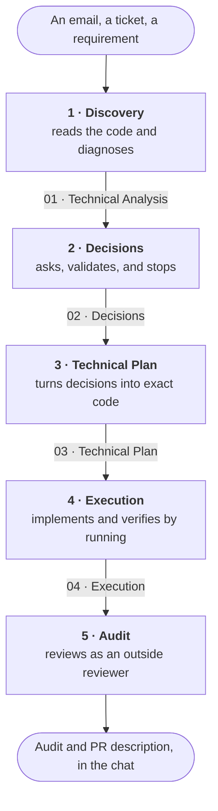

# 🧠 MCP Orquestador

*Read this in [Spanish](README.es.md) · This is the English README.*

An MCP (Model Context Protocol) server that splits every incoming requirement into **five gated phases**, and forces each one to leave a written document behind before the next can start. Your client's panel will show it as `phase-gate`.

> The server's interface is in English (tool names, parameters). The **phase prompts that drive the AI's behaviour are written in Spanish**, so the documents it produces come out in Spanish. If you want them in another language, translate `prompts/*.md` — no code changes needed.

## The problem

You ask an AI assistant to implement a requirement and it does what they all do: it starts writing code. It breaks something it never read. It quietly makes decisions it never asked you about. And when you switch chats, or sit down at your other machine, the entire reasoning is gone — because it lived in the conversation, and **conversations don't travel**.

## How it solves it

The assistant doesn't get to touch code until phase 4. By then it has diagnosed the problem by reading the repository, asked you what it couldn't decide alone, and written a plan checked against the real code. Every phase leaves a document in a central folder, so the thinking outlives both the chat and the device.



**The gate is phase 2**, and it's what gives the server its name: it stops there and will not move on until you answer. This isn't a polite suggestion to ask questions — the phase does not close without your answers, and whatever you decide gets written down with its rationale.

In phase 5 the AI only reads. **You always make the commits and open the PR.**

## Who it's for

For people working on **code that already exists and must not break**, who need a record of why each thing was done. It fits especially well if you work from more than one machine, or if you have to justify decisions weeks later.

It is not for throwaway prototypes or greenfield projects: five phases to change a colour is absurd ceremony.

It speaks standard MCP, so it works with any compatible client. It is **tested on Cursor, VS Code and Claude Code** — see [Step 4](#step-4--register-the-mcp-server-in-your-client).

---

## 📁 How the documentation is organised

Every task lives in a folder with this fixed structure:

```
DOCUMENTATION/
├── PROJECT-A/
│   └── Proyectos/
│       └── <task_name>/
│           ├── 00 - Contexto Inicial.md
│           ├── 01 - Análisis Técnico.md
│           ├── 03 - Plan Técnico.md
│           └── ...
├── PROJECT-B/
│   └── Proyectos/
│       └── <task_name>/
└── PROJECT-C/
    └── Proyectos/
        └── <task_name>/
```

The `Proyectos` level is the tasks subfolder, and its name is configurable — see `ORQUESTADOR_TASKS_SUBDIR` below. The document names come from the phase prompts, which is why they are in Spanish by default.

> The server builds this path **automatically**. You (or the LLM) only supply `project`, `task_name` and `file_name`; nobody has to type a full path.

---

## 💻 Setup, step by step (on ANY machine)

The code is identical everywhere; the only thing that changes between machines is **the paths to your folders**, because the system user and the documentation location differ. That's why they are environment variables and not constants in the code.

### Prerequisites
- **Node.js** 18 or newer. Check with `node -v`.
- **Git**.
- A folder for your central documentation, available locally. If it lives in a synced folder (OneDrive, Drive, Dropbox) it travels between your machines on its own.
- **An MCP client**: Cursor, VS Code or Claude Code.

### Step 1 — Clone the repository

```bash
git clone https://github.com/Montse2308/MCP_orquestador.git
cd MCP_orquestador
```

### Step 2 — Install dependencies and build
`build/` is **not** committed (it's in `.gitignore`), so it has to be generated on every machine:

```bash
npm install
npm run build
```

This creates `build/index.js`, which is what the client will run.

### Step 3 — Create your `.env` with THIS machine's paths

1. Copy the template:

```bash
cp .env.example .env
```

2. Edit `.env` and set your real paths (single backslashes on Windows, no quotes):

```ini
ORQUESTADOR_DOCS_PATH=C:\Users\YOUR_USER\OneDrive - YOUR ORGANISATION\Documents\DOCUMENTATION
ORQUESTADOR_REPOS_PATH=C:\projects
```

**Both are required and have no default value.** If one is missing, or points at a folder that doesn't exist, the tools that need it say so by name instead of failing later for some unrelated-looking reason.

> On Windows, save `.env` as **UTF-8 without BOM**. Creating it from PowerShell with `>` produces UTF-16, accented characters arrive mangled, and the path "doesn't exist" even though it looks right.

### Step 4 — Register the MCP server in your client

Since the paths live in `.env`, the client config stays generic: it only points at `build/index.js`. **The key you give it (`mcp-orquestador` in the examples) is what identifies the server and prefixes its tools** — the name the server reports for itself, `phase-gate`, is only what you'll see in the panel.

In all three cases, adjust the path to wherever you cloned the repo. Remember that in JSON every `\` must be doubled as `\\`.

<details open>
<summary><b>Cursor</b> — <code>~/.cursor/mcp.json</code> (create it if missing)</summary>

```json
{
  "mcpServers": {
    "mcp-orquestador": {
      "command": "node",
      "args": ["C:\\<WHERE_YOU_CLONED>\\MCP_orquestador\\build\\index.js"]
    }
  }
}
```
</details>

<details>
<summary><b>VS Code</b> — <code>%APPDATA%\Code\User\mcp.json</code></summary>

Two differences to watch: the top-level key is `servers`, not `mcpServers`, and `type` must be declared.

```json
{
  "servers": {
    "mcp-orquestador": {
      "type": "stdio",
      "command": "node",
      "args": ["C:\\<WHERE_YOU_CLONED>\\MCP_orquestador\\build\\index.js"]
    }
  }
}
```
</details>

<details>
<summary><b>Claude Code</b> — <code>.mcp.json</code> at the project root</summary>

Claude Code reads a `.mcp.json` from the project you're in. Since it launches the server from that folder, the path here can be **relative** — making this the only one of the three configs without an absolute path, so it works unchanged on any machine:

```json
{
  "mcpServers": {
    "mcp-orquestador": {
      "command": "node",
      "args": ["build/index.js"]
    }
  }
}
```

That covers working inside this repo. To use it from other projects, register the server with an absolute path in your user config (`claude mcp add`), or drop a `.mcp.json` into each project.
</details>

> **Without `.env`:** you can skip `.env` entirely and put the paths in an `"env"` block inside the client config instead. If a variable is defined in both places, the client's wins.

### Step 5 — Restart and verify
1. Restart the client, or toggle the server off and on in its MCP panel.
2. It should show up active with its 6 tools. In **Cursor** that's Settings → MCP; in **VS Code**, the extensions/MCP view; in **Claude Code**, `/mcp`.
3. Try it from the chat: *"Use the `get_active_task` tool from mcp-orquestador"* — it should answer, even if only to say there's no active task yet.

---

## 🔄 Working across several machines

- If your documentation lives in a synced folder, it travels on its own. The only per-machine file is `.env` (Step 3), which is local and never committed.
- The server remembers the **active task** (see `get_active_task`). That record is **local to each machine** and lives in your user data folder, outside the repo, so it survives deleting `build/` or re-cloning:
  - **Windows:** `%APPDATA%\mcp-orquestador\active_task.json`
  - **macOS:** `~/Library/Application Support/mcp-orquestador/active_task.json`
  - **Linux:** `~/.local/state/mcp-orquestador/active_task.json`

  If you switch machines or chats and the LLM "forgot" where to write, tell it to call `get_active_task`, or just give it `project` + `task_name`.
- **Golden rule:** let the sync finish before starting work on the other machine, to avoid conflicted copies.

---

## 🧩 What lives OUTSIDE the repo (one copy per machine)

`git pull` does **not** update these four things. If something stopped working right after pulling, the cause is almost always here.

| What | Where | Why it isn't in the repo |
|------|-------|--------------------------|
| The compiled server | `build/` in your clone | It's gitignored. **After every `git pull` that touches `src/`, run `npm run build`** or the client keeps executing the previous version. |
| This machine's paths | `.env` at the root (Step 3) | The system user and the documentation folder differ per machine. |
| The MCP registration | Your client's config (Step 4) | In Cursor and VS Code it holds the absolute path to `build/index.js`, which depends on where you cloned and points into a gitignored folder. No single path can be right on every machine. See [`docs/decisiones.md`](docs/decisiones.md). The exception is Claude Code's `.mcp.json`, which uses a relative path. |
| The `/f1`–`/f5` commands in **Cursor** | `~/.cursor/commands/f<N>.md` | Cursor only reads them from the user folder, so they're copied by hand on each machine. Not an issue in **Claude Code**: they're versioned in `.claude/commands/` and arrive with the pull. |

### The phase commands

You invoke them by typing `/f1`, `/f2`, etc. in the chat. **They are orchestration only**: which tools to call and in what order. The behaviour, the document's structure and its filename all come from the phase prompt in `prompts/`, so tuning a phase doesn't mean editing its command.

| Command | Calls | Document it leaves |
|---------|-------|--------------------|
| `/f1` | `start_task` + `get_phase_prompt(1)` | Phase 1's |
| `/f2` | `get_phase_prompt(2)`, reads phase 1's | Phase 2's, after you answer the questions |
| `/f3` | `get_phase_prompt(3)`, reads the previous ones | Phase 3's |
| `/f4` | `get_phase_prompt(4)`, reads the plan | Phase 4's, short and at the end |
| `/f5` | `get_phase_prompt(5)` | None: the audit and PR description go in the chat |

No command names a file: the name is declared in each phase prompt's header and `get_phase_prompt` hands it to the model.

`/f1` and `/f5` expect data after the command: `/f1` needs project, task_name and the full requirement; `/f5`, which commits to audit. The other three start from `get_active_task`.

**Where to put them, per client:**

- **Claude Code:** already in [`.claude/commands/`](.claude/commands), versioned. They work when you open this repo, no setup. To use them from your other projects, copy them to `~/.claude/commands/`.
- **Cursor:** copy them to `~/.cursor/commands/`. From there they work across all your projects.
- **VS Code:** no slash commands of its own; paste the file contents into the chat.

The exact contents of all five are also in [`docs/comandos-de-fase.md`](docs/comandos-de-fase.md) (Spanish).

---

## 🛠️ Available tools

| Tool | What it does |
|------|--------------|
| `start_task` | Creates the task folder (`<PROJECT>/<tasks subfolder>/<task>`), saves the initial context and registers the task as **active**. |
| `get_active_task` | Returns the current active task (project, name and path). Use it when opening a new chat or after losing track of where to write. |
| `get_phase_prompt` | Returns the behaviour rules for a phase (1–5), with the global rules prepended and the exact document filenames appended. The text lives in `prompts/`. |
| `read_central_doc` | Reads a file from the central documentation. **Recommended:** pass `project` + `task_name` + `file_name` and let the server build the path. It also accepts a relative `file_path`. |
| `write_central_doc` | Writes/overwrites a file. Same parameters as `read_central_doc` plus `content`. |
| `read_cross_repo` | Reads files from your other local repos, so you can check how another codebase solved something without switching windows. |

### How the server builds paths
- **Documentation:** `ORQUESTADOR_DOCS_PATH` / `<PROJECT>` / `ORQUESTADOR_TASKS_SUBDIR` / `<task>` / `<file>`
- **Code repos:** `ORQUESTADOR_REPOS_PATH` / `<repo>` / `<file>`

### What counts as a project

There is no list of projects to maintain. **A project is any folder that contains the tasks subfolder**, so registering a new one just means creating that subfolder. Folders without it — credentials, shared material, dead archives — stay out on their own.

A project that doesn't exist is rejected, showing the list of the ones that do, instead of silently creating a stray folder. To **start** a brand new project you have to ask on purpose: `start_task` accepts `crear_proyecto: true`, and without that flag a typo can't pollute your documentation.

> If you leave `ORQUESTADOR_TASKS_SUBDIR` empty, the rule can't be applied and **any** folder counts as a project.

---

## 📝 The phase prompts live in `prompts/`

Each phase's text is a plain markdown file, not code:

```
prompts/
├── global-rules.md              ← "Zero Breakage" rules, prepended to EVERY phase
├── fase-1-descubrimiento.md
├── fase-2-decisiones.md
├── fase-3-plan-tecnico.md
├── fase-4-ejecucion.md
└── fase-5-auditoria-pr.md       ← includes the PR description contract
```

**They are read on every call.** Edit a `.md` and the next `get_phase_prompt` already returns the new version — no `npm run build`, no client restart. That's what makes it practical to tune a phase and test it immediately.

Each phase declares, in a header at the top of the file, what its document is called:

```markdown
---
documento: 02 - Decisiones.md
---

# Decisiones
```

`get_phase_prompt` reads that header and appends, at the end of the prompt, the exact filename for this phase and for the previous ones. **That's why the `/f1`–`/f5` commands no longer name any file:** the name lives in one place, so changing a prompt doesn't force you to edit a command on every machine too. A phase without `documento` — like phase 5, which delivers in the chat — announces itself as such.

Phase 1 also declares `documento_inicial`, the file `start_task` writes with the initial context.

Format rules:
- The file must be named `fase-<N>-<anything>.md` (`phase-<N>-...` also works).
- The header is optional and never leaks into the prompt: it's stripped before delivery.
- **The number of phases is not hardcoded:** add `fase-6-deployment.md` and phase 6 exists immediately.
- The first `# Heading` in the file becomes the name shown in the tool description.
- `global-rules.md` is automatically prepended to the phase content.

### The PR description contract (phase 5)

Phase 5 doesn't only audit: it drafts the PR description under a strict contract, so the result is consistent regardless of which AI model is used.

- **Title:** `type(area): sentence`, and nothing else — no ticket numbers.
- **Fixed structure:** the why (`Problem` if something was broken, `Context` if it's new) → grouped `Changes` → closing sections.
- **Closing sections are conditional**, each with its own trigger: `Scope` only if you touched existing code, `Verification` only if the testing was substantial, `Deployment notes` only if there are migrations.
- **How bullets are grouped depends on the shape of the change** (by component, by sub-feature, by data dimension…), with a decision table in the prompt. The description adapts to the size of the ticket without becoming unpredictable.
- **Length limits in words**, not adjectives: trivial (60–100), small (120–160), normal (200–260), large (350–450, hard cap 500).
- **Delivered inside a four-backtick code block**, so copy-pasting into GitHub gives you raw markdown instead of already-rendered text.

To adapt it to your own style, edit `prompts/fase-5-auditoria-pr.md`. The highest-leverage change is replacing the examples under "EJEMPLOS DE REFERENCIA" with PR descriptions of your own: models imitate that voice far more than they follow instructions.

> The reasoning behind each rule is in [`docs/decisiones.md`](docs/decisiones.md) (Spanish). Read it before changing things: several rules that look arbitrary are solving a concrete problem.

---

## ⚙️ Environment variables

Loaded from the `.env` at the repo root, or from the `"env"` block in your client config.

The first two are **required and have no default**: they point at folders that only exist on your machine, so any default would be somebody else's path. If one is missing, or points at something that doesn't exist or isn't a folder, the tools that use it return the variable name and where to configure it. Tools that don't depend on it — like `get_phase_prompt` — keep working.

| Variable | Default | Description |
|----------|---------|-------------|
| `ORQUESTADOR_DOCS_PATH` | **none, required** | Path to the root of your central documentation. **Different on each machine.** |
| `ORQUESTADOR_REPOS_PATH` | **none, required** | Path to the folder holding your code repositories. |
| `ORQUESTADOR_TASKS_SUBDIR` | `Proyectos` | Subfolder where tasks live inside each project. Empty means tasks hang directly off the project. It's also the rule that decides what counts as a project (see above). |
| `ORQUESTADOR_PROMPTS_PATH` | `prompts/` at the repo root | Folder holding the phase prompts. Only needed if you keep your own set somewhere else. |
| `ORQUESTADOR_STATE_PATH` | Your user data folder (see above) | Where the active task is stored. Rarely needs touching; useful to isolate state in tests or force a specific location. |

---

## 🧑‍💻 Development (if you change the code)

> **Note:** this applies to **code** changes only. If all you edited was a prompt under `prompts/*.md`, there is **nothing to build and nothing to restart** — they're read on every call.

The source is `src/index.ts`. The client runs the compiled `build/index.js`, so after any change:

```bash
npm run build
```

Then restart the MCP server in your client so it picks up the new version.

Available scripts:
- `npm run build` → compiles TypeScript into `build/`.
- `npm start` → runs the compiled server.
- `npm run dev` → runs straight from TypeScript with `ts-node`.

### Where everything is

| What you're looking for | Where |
|-------------------------|-------|
| What the project does today | This README (and its Spanish twin, [`README.es.md`](README.es.md) — **change one, change the other**) |
| Why it's designed this way | [`docs/decisiones.md`](docs/decisiones.md) (Spanish) |
| The `/f1`–`/f5` commands, to recreate them elsewhere | [`docs/comandos-de-fase.md`](docs/comandos-de-fase.md) (Spanish) |
| What's still missing | [Issues](https://github.com/Montse2308/MCP_orquestador/issues) — grouped under the `v1-uso-propio` and `v2-publico` labels |
| What's already been done | The commit history and merged PRs |

---

## 📄 License

[MIT](LICENSE).
